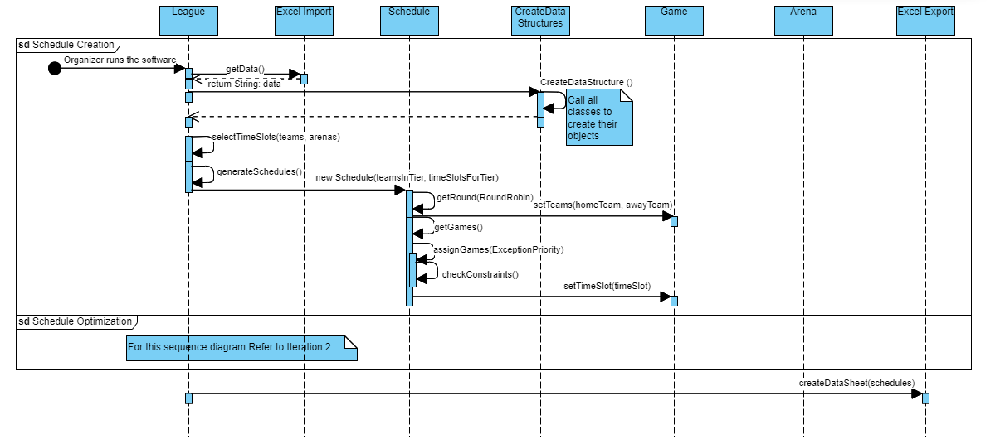
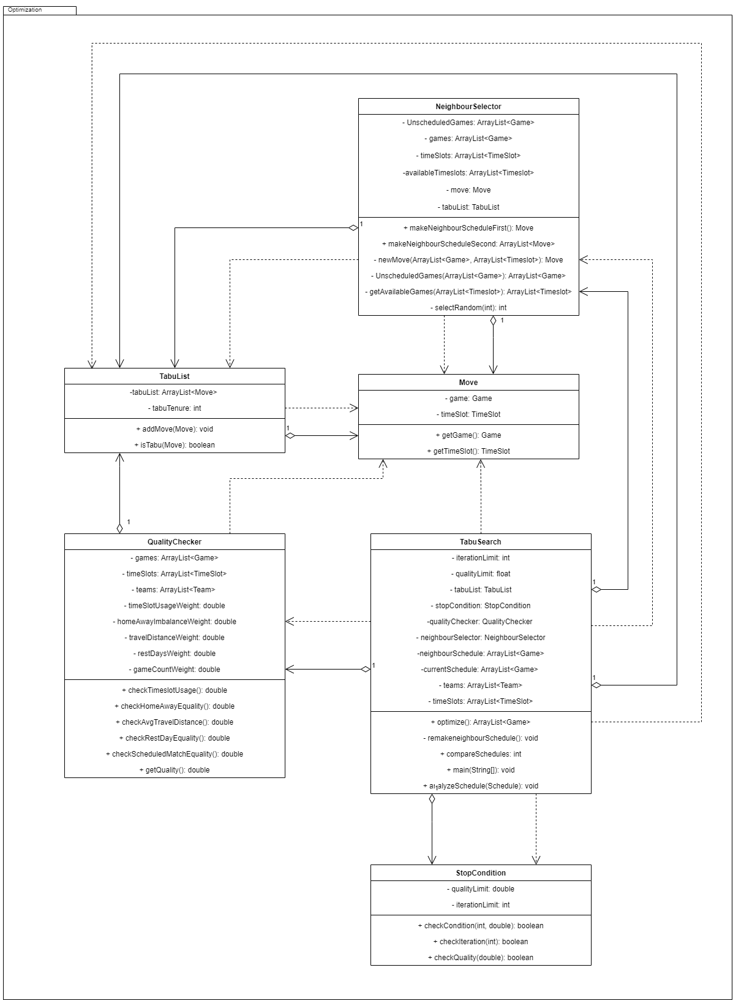

# Multi-variable-Sports-Scheduler

  

## Description 

This project focuses on an algorithm that takes input data provided by a sports league organizer from an excel document and creates a schedule that includes the team match ups, location and time slot for the games of a league season. Current automated schedulers will create a schedule with a round robin, or tournament style and only consider time slots that the system created and sometimes one day a week for practice or religious commitments. 
 
The striking difference of our scheduler is allowing for more dynamic schedules. The first key difference is the exceptions. Exceptions are provided days and times by each team determining when they are unavailable to play games. With current scheduling softwares they do not take multiple exceptions into account which cost teams money if a game is booked over a teams event. The second key difference is the ranking system which will be implemented later into the project's development. The scheduler will allow the league to create matchups for teams outside their tier. The main benefit for this is for more skill based matchups for less competitive leagues. Another difference that will be implemented if we have time is having multiple division per timeslot, where as current systems only have one.

## Notation

  
Coding Style

  
  ### Classes
    /**
    * Description
    *
    * @autor
    */
    public class ClassName{
    }
  ### Methods
      /**
      * Description
      * 
      * @author (if multiple authors for class)
      * @param
      * @return
      */
      public/private void methodName(){
      }
  ### Variables
       Local: Type variableName;
       Global: private Type variableName;
  ### Loops
       while (cond && cond){
       for (int i = 0; i < variable; i++){
  ### Comments
  #### Block Messages
    /* 
    * message
    */
    code
  #### Line Messages
    code 	// message

## Project Set Up

  
Downloading the program

  
  1. Download the zip file from github and extract
  2. Import the project into Eclipse 
  3. Add the dependencies
  4. Right-click project in the Package Explorer tab
  5. Open the Properties tab
  6. Go to Java Build Path and click in Libraries
  7. Select Classpath and click in Add JARs
  8. Navigate to External_Libraries folder Multi_variable_Sports_Scheduler/External_Libraries/External_Jars, select all of the jar files and click Ok
  9. Select Classpath and click Add Library
  10. Select JRE System Library, click Next
  11. Select Execution environment and click JavaSE-17(jre) from the dropdown menu. And click Finish
  12. Select Class path and click Add Library
  13. Select JUnit, click Next
  14. Select JUnit 5 from the dropdown menu, And click Finish
  15. Select Classpath and click Add Class Folder
  16. Navigate to Multi_variable_Sports_Scheduler/src/main/ and select resource. And click Ok
  17. Click Apply and Close

## Iterations

  
Iteration 1

  1. Creating initial scheduler. This consisted of:  
	- Importing from excel,  
	- Creating the data structures, 
	- Choosing timeslots for each Schedule, 
	- Creating matchups with Round Robin and 
	- Assiging matchups to timeslots 
  2. Class Diagram for Iteration 1 is below 
	  
  3. SeQuence Diagraom for Iteration 1
    

  
Iteration 2

   Creating Optimization System. This consisted of: 
		1. Creating the data structures 
			- TabuList, 
			- NeighborScheduler, 
			- Move and 
			- QualityChecker 
		2. Creating Swaps 
		3. Comparing Schedules 
		4. Flow Chart for Iteration 2 is below 
		  
		5. Class Diagraom for Iteration 2
		  

  
Iteration 3

  1. Code clean up  
  2. Testing  
  3. Ranked Implemnetation  
  4. UML for Iteration 3 
    

